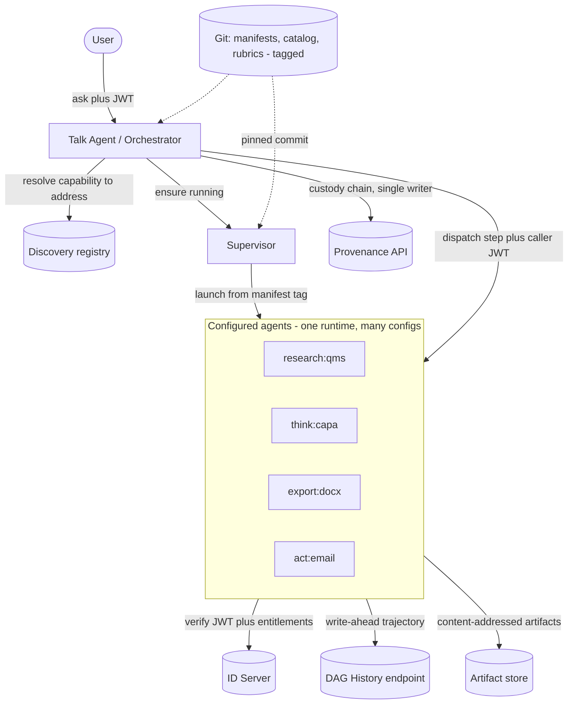
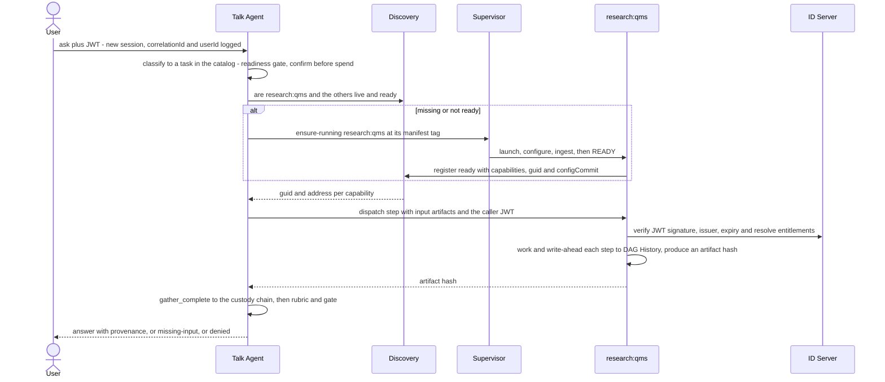

# SPEC — Agent platform & control plane (AgentAsSoftware)

**Status:** Design / thinking — not yet implemented · **Audience:** Dion + Claude Code
**Builds on:** [`SPEC-agent-topology-and-custody-dag.md`](SPEC-agent-topology-and-custody-dag.md)
(Phases 1–6: content-addressed artifacts, custody DAG, capability dispatch,
readiness gate, exporter/actioner). This doc adds the **control plane** that turns
those in-process roles into real, configured, remote agents.

This is a reference to refine, not a build order. Where it says "the agent does
X," that is the target design; the current code does most of it in-process.

---

## 1. The idea — AgentAsSoftware

An agent is a **generic runtime that specialises itself at boot from versioned
config**, advertises what it can do, and is composed by an orchestrator per a
recipe. Behaviour is declarative: the same binary becomes `research:qms` or
`export:docx` depending on the JSON it loads. Config is code — versioned in git,
pinned per run, recorded in custody.

The non-negotiable principle, because it is where distributed agent systems rot:
**keep three planes separate.**

| Plane | Question | Owner |
|---|---|---|
| **Discovery** | who is alive, where, ready? | Discovery (registry — exists) |
| **Supervision** | start / stop / health / ingest-to-ready | **Supervisor** (new) |
| **Authority** | whose permissions apply to this data access? | ID Server + the caller's token |

The Talk Agent asks Discovery and asks the Supervisor; it never launches
processes itself, and it never substitutes its own authority for the user's.

---

## 2. Components



- **Talk Agent (orchestrator)** — user-facing front door. Classifies the ask to a
  task, resolves the recipe → required capabilities, ensures agents are running,
  dispatches per the recipe, writes the custody chain, runs rubrics, gates on a
  human. The **only** custody-chain writer.
- **Discovery** — passive registry (exists). Agents self-register + heartbeat
  leases. Extended to report **`ready`** (ingested + serving) vs merely **`up`**.
- **Supervisor** — the launch plane (new). Knows how to start each agent (command,
  resources, which config tag), drives it to `ready`, applies idle/destroy policy.
- **ID Server** — identity + entitlements (exists). Signs the login JWT; agents
  verify it and resolve entitlements per request.
- **Provenance API** — durable mirror of the custody **chain** (exists as the
  `http` sink in `custody/sink.ts`).
- **DAG History endpoint** — durable, write-ahead store of per-agent **trajectory**
  (new; §7). Peer service, independent lifecycle.
- **Artifact store** — content-addressed artifacts (`custody_artifacts`, Phase 1).

---

## 3. Three config domains (all git-tagged)

Don't cram everything into one `agents.json`; these version and govern differently.

### 3a. Task catalog — what the Talk Agent can do
```jsonc
{
  "id": "capa",
  "aliases": ["corrective action", "8D"],
  "requiredInputs": [
    { "id": "defect", "capability": "research:qms", "required": true }
  ],
  "recipe": {                       // ordered steps; each names a CAPABILITY, not an agent
    "steps": [
      { "id": "gather", "kind": "gather",
        "requests": [{ "requires": "research:qms", "produces": "defect" }] },
      { "id": "ready",  "kind": "check_readiness", "inputs": ["gather"] },
      { "id": "draft",  "kind": "generate_section", "requires": "think:capa", "inputs": ["ready"] },
      { "id": "judge",  "kind": "judge", "inputs": ["draft"] },
      { "id": "human",  "kind": "require_human", "inputs": ["judge"] },
      { "id": "out",    "kind": "export", "format": "docx", "requires": "export:docx", "inputs": ["human"] }
    ]
  },
  "rubrics": [{ "name": "capa", "ref": "qms-rubrics@2026.02" }],   // §3c
  "exportFormats": ["md", "docx"]
}
```
This is today's rubric-`recipe` promoted to a first-class, user-visible catalog.

### 3b. Agent manifest — one `init.json` per agent (git tag = agent name)
```jsonc
{
  "name": "qms-eng-research",           // == the git tag it is configured from
  "role": "researcher",                 // researcher | thinker | exporter | actioner
  "capabilities": ["research:qms"],     // what it advertises to Discovery
  "identity": {                         // §6 — how it verifies the caller's JWT
    "idServerUrl": "http://localhost:3001",
    "issuer": "rehamd-idserver",
    "serviceTokenEnv": "IDSERVER_SERVICE_TOKEN"   // secret injected, never in git
  },
  "permissions": "engineering:internal",  // max operational scope; effective = min(user, this)
  "ingestion": {                        // §8 — code-heavy; a pipeline of converters
    "sources": [
      { "uri": "git://qms-corpus@2026.02/08_Governance", "pipeline": ["docx->md", "chunk", "embed"] }
    ],
    "schedule": "on-boot",              // on-boot | cron | webhook
    "state": "persistent"               // reuse ingested state across restarts (warm)
  },
  "resources": { "cpu": 2, "memoryMb": 4096 }
}
```

### 3c. Rubric repo — judgment, tagged
Own git repo of rubric JSON, referenced by `name@tag` from the catalog. Extends the
existing `rubric-release.ts` "Update from git". A run pins the resolved commit.

---

## 4. The `/ask` flow



Maps your steps 1–9. The classification in step 1 is the **new non-deterministic
seam** — bracket it like the thinker: deterministic catalog match first, LLM only
to disambiguate, and confirm the plan before the expensive fan-out.

---

## 5. Agent lifecycle — creation & destruction

**Separate the process lifecycle from the data lifecycle.** Killing a research
agent must not destroy what it ingested.

States: `launching → configuring → ingesting → ready → (serving⇄idle) → draining → stopped`.

**Creation** (Supervisor):
1. Resolve the manifest at its git tag → pin the commit.
2. Launch the runtime with config + injected secrets (service token, JWT secret).
3. Agent runs its ingestion pipeline **to `ready`** (idempotent + incremental —
   re-ingest only deltas by source-sha; reuse persistent state so a relaunch is
   *warm*, not a cold multi-minute re-ingest).
4. Register with Discovery advertising `ready` + capabilities + `configCommit`.

**Destruction:**
- **Graceful** (idle policy, or explicit stop): Supervisor sends `SIGTERM` →
  agent **drains** (finish in-flight, flush trajectory tail + write the terminal
  marker, deregister from Discovery) → exit. Ingested state persists.
- **Crash / SIGKILL / OOM:** no graceful path. Discovery's lease **expires** →
  agent drops from the live list. Reconciliation reads the DAG History: last step
  with no terminal marker = "died mid-op at step N" (§7). Supervisor may relaunch;
  because ingestion state is persistent, relaunch is warm.

**Warm pool vs on-demand:** keep the common agents (qms research, the thinker)
warm to avoid cold-start latency on the first `/ask`; launch rare ones on demand.
The Talk Agent always waits for **`ready`**, never merely `up`.

---

## 6. Authority — JWT propagation & the confused-deputy rule

**The caller's JWT flows with every dispatch.** This is the single most important
security property, and it dictates that **each agent's config carries the ID
Server address** (your point).

On each dispatched task an agent:
1. **Verifies the caller's JWT** — signature (shared `JWT_SECRET` or the ID
   Server's JWKS), **issuer** (accept `rehamd-idserver`), expiry. Config supplies
   `identity.idServerUrl` + `identity.issuer`; the secret is injected, never in git.
2. **Resolves entitlements per request** against the ID Server (revocable — a
   cached label can't outlive a revocation).
3. **Bounds every data access to `min(user, agent)`.** The manifest `permissions`
   (may be `"all"`) is the agent's *maximum operational scope*; effective access is
   the **intersection with the user's entitlements**. An agent must NEVER use its
   own service identity to fetch data it returns to a user — that is the
   confused-deputy hole, and `"all"` makes it a chasm. The service identity is for
   boot / register / read-own-config only.

This is exactly the http-identity-mode path the integration tests already exercise
(`QMS_IDENTITY_MODE=http`, `QMS_IDENTITY_URL`, `IDSERVER_SERVICE_TOKEN`,
`config.api.identityIssuer`). The manifest formalises what is in `.env` today.

---

## 7. Custody chain + trajectory history (durability)

Two records, two guarantees — do not conflate them.

| | **Custody chain** | **Trajectory history** |
|---|---|---|
| Question | what data flowed *between* agents? | what did each agent do *internally*, and where did it stop? |
| Guarantee | tamper-evident, authoritative | complete, durable, forensic |
| Writer | **orchestrator only** (single-writer) | **each agent, its own lane** |
| Store | `custody_events` + Provenance API mirror | **DAG History endpoint** (new) |

**Write-ahead, not write-on-shutdown.** Each step appends to the History endpoint
**as it completes** — that is the durability guarantee; a `SIGKILL`/OOM/power-loss
skips any shutdown handler, so a shutdown flush is *cleanup*, never the guarantee.

Per-step record (immutable):
```
TrajectoryStep {
  correlationId,  agentGuid,  capability,
  seq,            // this agent's OWN monotonic counter (no global counter -> no contention)
  kind,           // "retrieve" | "query_table" | "ingest_batch" | ...
  input,          // references only (query shape, source path) — never raw data
  outputRef,      // content hash produced, or null
  status,         // "ok" | "error"
  error?,  at
}
```
Terminal record on completion (good **or** bad):
`{ correlationId, agentGuid, outcome: "completed"|"failed"|"shutdown", finalRef?, reason? }`.

**Idempotent + append-only on `(correlationId, agentGuid, seq)`** — because the
agent-side local WAL retries when the endpoint blips, the same step will POST
twice; a duplicate is a no-op (a `unique` constraint). `seq` is per-agent, so no
two writers ever contend — that is what makes multi-writer safe. Cross-agent order
is the artifact-hash DAG the chain already holds.

What it buys: **where did it die** (last non-terminal `seq` + expired lease),
**did it consult the required source** (the auto-fail trajectory rubric, now from a
durable store), and **can it resume** (replay from the last `ok` step with an
`outputRef` + the content-addressed artifact — the atomicity answer).

Grounded in existing code: `agent_run_steps` + `recordRunStep` already write
trajectory per-step to *local* Postgres, which `sink.ts` explicitly calls
ephemeral. This adds the external mirror, exactly as the chain already has one.

---

## 8. Deduplication

Two distinct concerns; don't solve one and think you solved both.

**8a. Caller idempotency — same request twice.** A retry or double-submit must not
do the work twice. The `/ask` carries an **idempotency key** (client-supplied, or
the hash of `{userId, normalized question, task}`). Before executing, look up the
custody/result store for a completed run under that key → return the cached result
+ its provenance. Cheap, and it also makes the whole route safely retryable.

**8b. Result dedup / merge across agents.** When several researchers return
overlapping findings:
- **Identical content collapses for free** — content-addressing (Phase 1): same
  bytes → one artifact hash. No work.
- **Semantically overlapping** findings (web + qms return the same fact, worded
  differently) need a **merge step**, declared in the recipe so it is auditable.
  Deterministic where possible (dedupe by `(sourceRef, claim-key)`); an LLM merge
  only where structure can't decide, and even then its output is validated. Keep
  it a real step (`kind: "merge"`) before the thinker, not hidden inside it.

---

## 9. Config as git tags

`qms-eng-research` as a bare tag is a *mutable pointer* — fine for "latest config,"
fatal for reproducibility. So:
- Config repos with a path per agent / rubric; **immutable release tags**
  (`qms-eng-research@2026.02`).
- Launch resolves name → latest release; the run **pins the resolved commit hash
  into custody**. "Regenerate this exact document" replays the pinned commit.
- Governs like rubrics already do: humans push tags; the GUI never deploys.

---

## 10. Extensibility — pluggable ingestion converters

Ingestion is code-heavy and the place you want to grow (HTML docs, web search →
MD, web search → natural language). Model it as a **registry of typed converters**,
so growth is *config + a new converter*, never core surgery.

```
Converter { from: <mime/type>, to: <mime/type>, run(input, ctx): output }
```
A source's `pipeline` is a chain of converter ids; the runtime resolves each by
`(from → to)`. Your roadmap becomes registered converters:

| Converter | from → to | Notes |
|---|---|---|
| `docx->md` | Word → Markdown | exists (renderer) |
| `html->md` | HTML → Markdown | **new** — readability extract then serialise |
| `websearch->md` | search results → Markdown | **new** — fetch + `html->md` per hit |
| `websearch->nl` | search results → natural-language summary | **new** — LLM step; its output validated, sourceRef pinned |
| `xlsx->table` | spreadsheet → structured rows | exists (table-loader) |

Two rules keep this clean: a converter is **pure `input → output`** (testable with
golden files, like the exporter), and **any LLM-bearing converter (e.g.
`websearch->nl`) records a `sourceRef`** so a generated summary is never mistaken
for a retrieved fact. New capability = register a converter + reference it in a
manifest's `pipeline`. No new agent code.

---

## 11. Locked decisions

1. Three planes stay separate: Discovery (registry) ≠ Supervisor (launch) ≠ ID
   Server (authority). The Talk Agent orchestrates; it never launches or
   substitutes authority.
2. The **caller's JWT propagates**; data access is `min(user, agent)`; each agent's
   config carries the ID Server address. `"all"` is scope, not a bypass.
3. Trajectory is **write-ahead** to a durable History endpoint; shutdown flush is
   cleanup. Idempotent on `(correlationId, agentGuid, seq)`.
4. Custody chain stays **single-writer** (orchestrator); trajectory is multi-writer,
   per-agent lane. Different guarantees, joined by the artifact hash.
5. Config + rubrics are git, **immutable release tags**, pinned per run.
6. Process lifecycle ≠ data lifecycle: destroying an agent never destroys its
   ingested state; relaunch is warm.
7. Ingestion is a **registry of pure typed converters**; extensibility = new
   converter + config.

## 12. Open questions

- **Supervisor placement** — co-located with Discovery, or its own service? (Leaning
  own service; it has a distinct failure mode.)
- **Idle-destroy policy** — TTL, or LRU under a resource cap? Who sets it (manifest
  vs global)?
- **Result store for §8a idempotency** — reuse custody keyed by correlation, or a
  dedicated results cache with its own TTL?
- **Converter sandboxing** — `html->md` / `websearch->*` fetch untrusted content;
  network + parser isolation, and treating fetched content as data-not-instructions.
- **Talk-agent classification** — how much LLM vs a deterministic catalog matcher.

## 13. Sequencing (when you build)

1. Remote `CapabilityRegistry` backed by Discovery (the Phase 5 seam → real).
2. Agent manifest + boot-from-git-tag + self-register(`ready`).
3. DAG History endpoint + write-ahead mirror of `recordRunStep`.
4. Supervisor (ensure-running + ingest-to-ready + idle policy).
5. Talk Agent (classify → confirm → orchestrate) — last, once its pieces exist.
6. Converter registry + the first new converter (`html->md`).

## Glossary
- **Talk Agent / Orchestrator** — user-facing front door; sole custody-chain writer.
- **Supervisor** — launches/stops agents, drives ingestion to `ready`.
- **Manifest (`init.json`)** — an agent's declarative config, git-tagged by name.
- **Capability** — a stable id (`research:qms`) an agent advertises and a step requires.
- **DAG History** — durable, write-ahead, per-agent trajectory store.
- **Converter** — a pure typed `input → output` ingestion transform.
