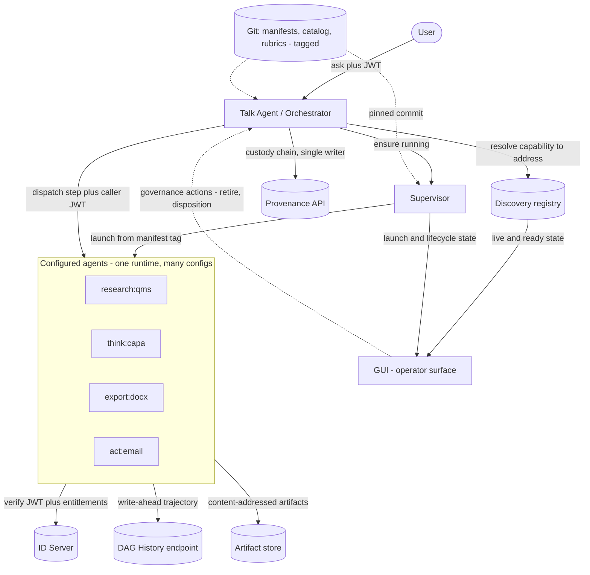
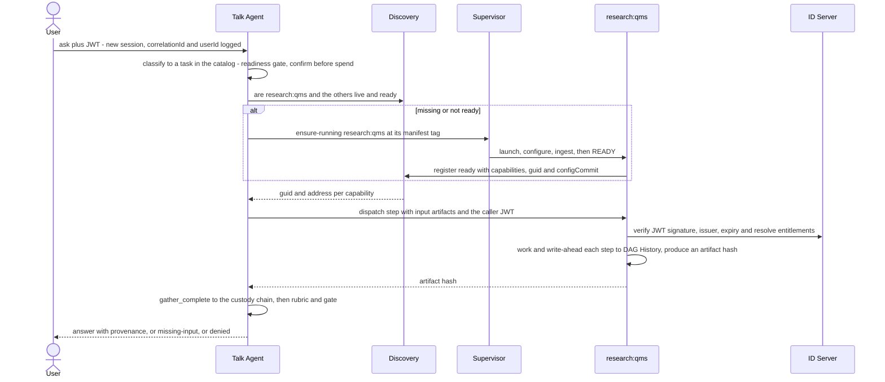

# SPEC — Agent platform & control plane (AgentAsSoftware)

**Status:** Design — not yet implemented · **Audience:** Engineering / implementation
**Builds on:** [`SPEC-agent-topology-and-custody-dag.md`](SPEC-agent-topology-and-custody-dag.md)
(Phases 1–6: content-addressed artifacts, custody DAG, capability dispatch,
readiness gate, exporter/actioner). This document specifies the **control plane**
that turns those in-process roles into configured, remote agents.

This is a design reference, not a build order. Where it states "the agent does X,"
that is the target design; the current code performs most of it in-process.

---

## 1. Concept — AgentAsSoftware

An agent is a **generic runtime that specialises itself at boot from versioned
config**, advertises its capabilities, and is composed by an orchestrator per a
recipe. Behaviour is declarative: the same binary becomes `research:qms` or
`export:docx` according to the configuration it loads. Configuration is code —
versioned in git, pinned per run, recorded in custody.

The governing principle, and the primary failure point in distributed agent
systems, is that **three planes must remain separate.**

| Plane | Question | Owner |
|---|---|---|
| **Discovery** | Which agents are live, at which address, and ready? | Discovery (registry — existing) |
| **Supervision** | start / stop / health / ingest-to-ready | **Supervisor** (new) |
| **Authority** | Whose permissions apply to a given data access? | ID Server + the caller's token |

The Talk Agent queries Discovery and instructs the Supervisor. It never launches
processes directly, and it never substitutes its own authority for the caller's.

---

## 2. Components



- **Talk Agent (orchestrator)** — user-facing entry point. Classifies the request
  to a task, resolves the recipe → required capabilities, ensures agents are
  running, dispatches per the recipe, writes the custody chain, runs rubrics, and
  gates on human review. The **only** custody-chain writer.
- **Discovery** — passive registry (existing). Agents self-register and hold
  heartbeat leases. Extended to report **`ready`** (ingested and serving) versus
  merely **`up`**.
- **Supervisor** — the launch plane, a **separate service** (new). Determines how
  to start each agent (command, resources, config tag), drives it to `ready`, and
  applies a **TTL idle-destroy policy** (§5). It is separate from Discovery
  deliberately: it has a distinct failure mode (launching processes) from a
  registry (recording liveness).
- **GUI** — the operator surface (existing client, extended). It renders network
  and system status from Discovery (which agents are live and `ready`) and the
  Supervisor (launch and lifecycle state) as **read-only** observability. It also
  issues **governance actions** on the run record — review disposition and the
  **retirement of decision branches** (§7) — each custody-recorded and gated.
  Process control (start and stop of agents) remains with the Supervisor; the GUI
  does not launch or terminate processes.
- **ID Server** — identity and entitlements (existing). Signs the login JWT; agents
  verify it and resolve entitlements per request.
- **Provenance API** — durable mirror of the custody **chain** (existing, as the
  `http` sink in `custody/sink.ts`).
- **DAG History endpoint** — durable, write-ahead store of per-agent **trajectory**
  (new; §7). A peer service with an independent lifecycle.
- **Artifact store** — content-addressed artifacts (`custody_artifacts`, Phase 1).

---

## 3. Three config domains (all git-tagged)

These are not consolidated into a single `agents.json`: they version and govern
differently.

### 3a. Task catalog — the tasks the Talk Agent can perform
```jsonc
{
  "id": "capa",
  "aliases": ["corrective action", "8D"],
  "requiredInputs": [
    { "id": "defect", "capability": "research:qms", "required": true }
  ],
  "recipe": {                       // ordered steps; each names a CAPABILITY, not an agent
    "steps": [
      { "id": "gather", "kind": "gather",
        "requests": [{ "requires": "research:qms", "produces": "defect" }] },
      { "id": "ready",  "kind": "check_readiness", "inputs": ["gather"] },
      { "id": "draft",  "kind": "generate_section", "requires": "think:capa", "inputs": ["ready"] },
      { "id": "judge",  "kind": "judge", "inputs": ["draft"] },
      { "id": "human",  "kind": "require_human", "inputs": ["judge"] },
      { "id": "out",    "kind": "export", "format": "docx", "requires": "export:docx", "inputs": ["human"] }
    ]
  },
  "rubrics": [{ "name": "capa", "ref": "qms-rubrics@2026.02" }],   // §3c
  "exportFormats": ["md", "docx"]
}
```
This is the existing rubric-`recipe`, promoted to a first-class, user-visible catalog.

### 3b. Agent manifest — one `init.json` per agent (git tag = agent name)
```jsonc
{
  "name": "qms-eng-research",           // == the git tag it is configured from
  "role": "researcher",                 // researcher | thinker | exporter | actioner
  "capabilities": ["research:qms"],     // what it advertises to Discovery
  "identity": {                         // §6 — how it verifies the caller's JWT
    "idServerUrl": "http://localhost:3001",
    "issuer": "rehamd-idserver",
    "serviceTokenEnv": "IDSERVER_SERVICE_TOKEN"   // secret injected, never in git
  },
  "permissions": "engineering:internal",  // max operational scope; effective = min(user, this)
  "ingestion": {                        // §8 — code-heavy; a pipeline of converters
    "sources": [
      { "uri": "git://qms-corpus@2026.02/08_Governance", "pipeline": ["docx->md", "chunk", "embed"] }
    ],
    "schedule": "on-boot",              // on-boot | cron | webhook
    "state": "persistent"               // reuse ingested state across restarts (warm)
  },
  "resources": { "cpu": 2, "memoryMb": 4096 }
}
```

### 3c. Rubric repo — judgment, tagged
A dedicated git repo of rubric JSON, referenced by `name@tag` from the catalog.
Extends the existing `rubric-release.ts` "Update from git". Each run pins the
resolved commit.

---

## 4. The `/ask` flow



Maps steps 1–9. Step 1 is **capability selection**: the Talk Agent traverses the
catalog of available capabilities and selects the one or more whose declared scope
is closest to the request. Selecting more than one produces a fan-out. This is the
**non-deterministic seam** and must be bracketed as the thinker is — a
deterministic catalog match where the request maps cleanly, the LLM only to rank
or disambiguate close candidates, and confirmation of the selected capabilities
before the fan-out is spent.

---

## 5. Agent lifecycle — creation & destruction

**The process lifecycle and the data lifecycle are separate.** Terminating a
research agent must not destroy its ingested state.

States: `launching → configuring → ingesting → ready → (serving⇄idle) → draining → stopped`.

**Creation** (Supervisor):
1. Resolve the manifest at its git tag and pin the commit.
2. Launch the runtime with configuration and injected secrets (service token, JWT
   secret).
3. The agent runs its ingestion pipeline **to `ready`** — idempotent and
   incremental, re-ingesting only deltas by source-sha, and reusing persistent
   state so that a relaunch is *warm* rather than a cold multi-minute re-ingest.
4. Register with Discovery, advertising `ready`, capabilities, and `configCommit`.

**Destruction:**
- **Graceful** (TTL idle expiry, or explicit stop): the Supervisor destroys an
  agent after a configurable idle **TTL** with no dispatched work, or on explicit
  request. It sends `SIGTERM`; the agent **drains** — completes in-flight work,
  flushes the trajectory tail, writes the terminal marker, deregisters from
  Discovery — and exits. Ingested state persists.
- **Crash / SIGKILL / OOM:** no graceful path. The Discovery lease **expires** and
  the agent is dropped from the live list. Reconciliation reads the DAG History:
  the last step with no terminal marker indicates termination mid-operation at step
  N (§7). The Supervisor may relaunch; because ingestion state is persistent, the
  relaunch is warm.

**Warm pool versus on-demand:** the common agents (QMS research, the thinker) are
kept warm to avoid cold-start latency on the first `/ask`; rare agents are launched
on demand. The Talk Agent always waits for **`ready`**, never merely `up`.

---

## 6. Authority — JWT propagation & the confused-deputy rule

**The caller's JWT accompanies every dispatch.** This is the primary security
property, and it requires that **each agent's config carry the ID Server address.**

On each dispatched task, an agent:
1. **Verifies the caller's JWT** — signature (shared `JWT_SECRET` or the ID
   Server's JWKS), **issuer** (accepting `rehamd-idserver`), and expiry.
   Configuration supplies `identity.idServerUrl` and `identity.issuer`; the secret
   is injected, never committed to git.
2. **Resolves entitlements per request** against the ID Server (revocable — a
   cached label cannot outlive a revocation).
3. **Bounds every data access to `min(user, agent)`.** The manifest `permissions`
   (which may be `"all"`) is the agent's *maximum operational scope*; effective
   access is the **intersection with the user's entitlements**. An agent must never
   use its own service identity to fetch data returned to a user: that is the
   confused-deputy vulnerability, which `"all"` maximises. The service identity is
   for boot, registration, and reading its own configuration only.

This is the http-identity-mode path exercised by the integration tests
(`QMS_IDENTITY_MODE=http`, `QMS_IDENTITY_URL`, `IDSERVER_SERVICE_TOKEN`,
`config.api.identityIssuer`). The manifest formalises what currently resides in
`.env`.

---

## 7. Custody chain + trajectory history (durability)

Two records, two guarantees; they must not be conflated.

| | **Custody chain** | **Trajectory history** |
|---|---|---|
| Question | What data flowed *between* agents? | What did each agent do *internally*, and where did it stop? |
| Guarantee | tamper-evident, authoritative | complete, durable, forensic |
| Writer | **orchestrator only** (single-writer) | **each agent, its own lane** |
| Store | `custody_events` + Provenance API mirror | **DAG History endpoint** (new) |

**Write-ahead, not write-on-shutdown.** Each step appends to the History endpoint
**as it completes**, and that is the durability guarantee. A `SIGKILL`, OOM, or
power loss skips any shutdown handler, so a shutdown flush is cleanup, never the
guarantee.

Per-step record (immutable):
```
TrajectoryStep {
  correlationId,  agentGuid,  capability,
  seq,            // this agent's OWN monotonic counter (no global counter -> no contention)
  kind,           // "retrieve" | "query_table" | "ingest_batch" | ...
  input,          // references only (query shape, source path) — never raw data
  outputRef,      // content hash produced, or null
  status,         // "ok" | "error"
  error?,  at
}
```
Terminal record on completion (success or failure):
`{ correlationId, agentGuid, outcome: "completed"|"failed"|"shutdown", finalRef?, reason? }`.

**Idempotent and append-only on `(correlationId, agentGuid, seq)`.** Because the
agent-side local WAL retries when the endpoint is briefly unavailable, a step may
be posted twice; a duplicate is a no-op (a `unique` constraint). `seq` is
per-agent, so no two writers contend — which is what makes multi-writer safe.
Cross-agent order is provided by the artifact-hash DAG the chain already holds.

This provides three capabilities, each a single query on `correlationId`:
**where a run terminated** (the last non-terminal `seq` plus an expired lease),
**whether the required source was consulted** (the auto-fail trajectory rubric,
now sourced from a durable store), and **whether a run can resume** (replay from
the last `ok` step with an `outputRef` and its content-addressed artifact — the
atomicity property).

In existing code, `agent_run_steps` and `recordRunStep` already write trajectory
per-step to *local* Postgres, which `sink.ts` explicitly designates ephemeral.
This adds the external mirror, exactly as the chain already has one.

### Decision branches & retirement

A run is a DAG, and it **branches** wherever it diverges into alternatives: a
k-sampling candidate set, a fan-out to several capabilities that return competing
artifacts, a re-run after a rejected draft, or a superseded document version. Each
alternative is a branch of the decision DAG.

The custody chain is append-only, so a branch is never deleted — deletion would
break tamper-evidence and the audit trail a QMS requires. A branch is instead
**retired**: a governed action, initiated from the GUI, that marks the branch
superseded so that it is no longer active, no longer consumed by downstream steps,
and no longer presented as current. Retirement is itself a `human_decision` event
recording the actor, the time, and the reason; the branch and its trajectory
remain in the record. This reconciles the two requirements — retain the evidence of
what was attempted and abandoned, and close the decision so the active set stays
clean. Retirement is gated (approver ≠ author, as with approval) and is reversed
only by a further recorded decision, never by erasure.

Two distinct concerns; addressing one does not address the other.

**8a. Caller idempotency — the same request submitted twice.** A retry or
double-submit must not perform the work twice. The `/ask` carries an **idempotency
key** (client-supplied, or the hash of `{userId, normalized question, task}`).
Before execution, the custody/result store is consulted for a completed run under
that key; if present, the cached result and its provenance are returned. This is
inexpensive and makes the route safely retryable.

**8b. Result deduplication and merge across agents.** Where several researchers
return overlapping findings:
- **Identical content collapses without additional work** — content-addressing
  (Phase 1): identical bytes yield one artifact hash.
- **Semantically overlapping** findings (web and QMS returning the same fact,
  worded differently) require a **merge step**, declared in the recipe so that it
  is auditable. Deterministic where possible (deduplication by
  `(sourceRef, claim-key)`); an LLM merge only where structure cannot decide, and
  its output validated in that case. It is a distinct step (`kind: "merge"`)
  preceding the thinker, not embedded within it.

---

## 9. Config as git tags

`qms-eng-research` as a bare tag is a *mutable pointer* — acceptable for "latest
config" but fatal for reproducibility. Therefore:
- Config repos with a path per agent and per rubric, and **immutable release tags**
  (`qms-eng-research@2026.02`).
- Launch resolves the name to the latest release; the run **pins the resolved
  commit hash into custody**. Regenerating a specific document replays the pinned
  commit.
- Governed as rubrics are: humans push tags; the GUI never deploys.

---

## 10. Extensibility — pluggable ingestion converters

Ingestion is code-heavy and the primary area of planned extension (HTML documents,
web-search → Markdown, web-search → natural language). It is modelled as a
**registry of typed converters**, so that extension is *configuration plus a new
converter*, never modification of the core.

```
Converter { from: <mime/type>, to: <mime/type>, run(input, ctx): output }
```
A source's `pipeline` is a chain of converter ids; the runtime resolves each by
`(from → to)`. The planned extensions become registered converters:

| Converter | from → to | Notes |
|---|---|---|
| `docx->md` | Word → Markdown | exists (renderer) |
| `html->md` | HTML → Markdown | **new** — readability extract, then serialise |
| `websearch->md` | search results → Markdown | **new** — fetch, then `html->md` per hit |
| `websearch->nl` | search results → natural-language summary | **new** — LLM step; output validated, sourceRef pinned |
| `xlsx->table` | spreadsheet → structured rows | exists (table-loader) |

Two constraints preserve this model: a converter is **pure `input → output`**
(testable with golden files, as the exporter is), and **any LLM-bearing converter
(for example `websearch->nl`) records a `sourceRef`**, so that a generated summary
is never mistaken for a retrieved fact. A new capability is a registered converter
referenced from a manifest's `pipeline` — no new agent code.

---

## 11. Locked decisions

1. The three planes remain separate: Discovery (registry) ≠ Supervisor (launch) ≠
   ID Server (authority). The Talk Agent orchestrates; it never launches processes
   or substitutes authority.
2. The **caller's JWT propagates**; data access is `min(user, agent)`; each agent's
   config carries the ID Server address. `"all"` is scope, not a bypass.
3. Trajectory is **write-ahead** to a durable History endpoint; the shutdown flush
   is cleanup. Idempotent on `(correlationId, agentGuid, seq)`.
4. The custody chain remains **single-writer** (orchestrator); trajectory is
   multi-writer, per-agent lane. Different guarantees, joined by the artifact hash.
5. Config and rubrics are git, **immutable release tags**, pinned per run.
6. The process lifecycle is distinct from the data lifecycle: destroying an agent
   never destroys its ingested state; a relaunch is warm.
7. Ingestion is a **registry of pure typed converters**; extension is a new
   converter plus configuration.
8. The **Supervisor is a separate service**, distinct from Discovery (a distinct
   failure mode: launching processes versus recording liveness).
9. Idle destruction is governed by a configurable **TTL**: an agent with no
   dispatched work for the TTL period is destroyed; ingested state persists.
10. Capability selection traverses the catalog and selects the **closest one or
    more capabilities** to the request; multiple selections fan out.
11. The **GUI** renders network and system status from Discovery and the
    Supervisor as read-only observability, and issues custody-recorded, gated
    governance actions on the run record; it never performs process control.
12. Decision branches are **retired, not deleted**: retirement is an append-only,
    gated `human_decision` recorded in custody; the branch and its trajectory are
    retained, and it is reversed only by a further recorded decision.

## 12. Open questions

- **Result store for §8a idempotency** — reuse custody keyed by correlation, or a
  dedicated results cache with its own TTL?
- **Converter sandboxing** — `html->md` and `websearch->*` fetch untrusted content;
  network and parser isolation, and treatment of fetched content as data, not
  instructions.
- **TTL value and scope** — a single global idle TTL, or per-manifest overrides
  (a warm-pool agent may warrant a longer TTL than an on-demand one)?
- **Selection threshold** — the similarity floor below which the Talk Agent asks
  for clarification rather than selecting a capability.

## 13. Implementation sequence

1. Remote `CapabilityRegistry` backed by Discovery (the Phase 5 seam made real).
2. Agent manifest, boot-from-git-tag, and self-registration (`ready`).
3. DAG History endpoint and the write-ahead mirror of `recordRunStep`.
4. Supervisor (ensure-running, ingest-to-ready, idle policy).
5. Talk Agent (classify → confirm → orchestrate), last, once its dependencies
   exist.
6. Converter registry and the first new converter (`html->md`).

## Glossary
- **Talk Agent / Orchestrator** — user-facing entry point; sole custody-chain writer.
- **Supervisor** — launches and stops agents, drives ingestion to `ready`.
- **Manifest (`init.json`)** — an agent's declarative config, git-tagged by name.
- **Capability** — a stable id (`research:qms`) an agent advertises and a step requires.
- **DAG History** — durable, write-ahead, per-agent trajectory store.
- **Converter** — a pure typed `input → output` ingestion transform.
